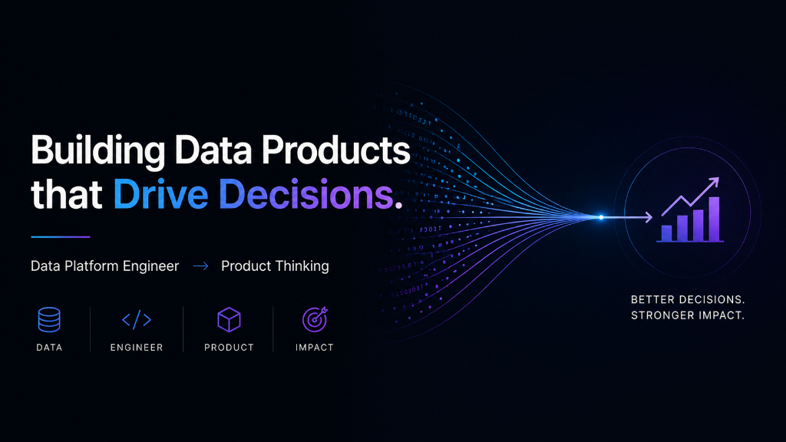

<p align="center">
  
</p>

<p align="center">
  
</p>

<br/>

<p align="center">
  
  
  
  
</p>

<br/>

<p align="center">
  
  
  
  
  
</p>

<br/>

---

<h2 align="center">⚡ The Shift</h2>

<p align="center">Most PMs learn systems through diagrams. I learned product thinking through systems.</p>

After **12+ years** designing enterprise data platforms (Azure, Spark, large-scale ETL), I kept noticing the same pattern: **the hardest problems weren't technical — they were decision problems** disguised as engineering tickets. Which data should we trust? What metric actually reflects user value? When does ML add complexity without adding lift?

I stopped waiting for a PM to answer those questions and started answering them myself.

<br/>

---

<h2 align="center">🧭 How I Think About Problems</h2>

<br/>

| Dimension | What I Ask | Why It Matters |
|:---:|:---|:---|
| 🔀 **Trade-off Analysis** | *"Does this need ML, or will a heuristic with 80% accuracy ship 10x faster?"* | Prevents over-engineering |
| 📊 **Metric Design** | *"Are we measuring what moves the business, or what's easy to measure?"* | Aligns teams on outcomes, not outputs |
| 🗺️ **Stakeholder Mapping** | *"Who disagrees with this decision, and what data would change their mind?"* | Reduces alignment debt early |
| ⚖️ **Cost vs. Value** | *"What's the cost of being wrong here vs. the cost of waiting to be right?"* | Forces prioritization clarity |

<br/>

---

<h2 align="center">🚀 Featured Work</h2>

<p align="center"><em>These aren't toy projects. Each one encodes a real product decision.</em></p>

<br/>

<table>
<tr>
<td width="33%" valign="top">

### [🧠 Decision Intelligence System](https://github.com/Rick-developer/E-commerce-Decision-Intelligence-System)


**Problem:** Recommendations optimized for clicks leave margin on the table.

**Key Decision:** Don't replace the behavioral model — layer a margin-aware reordering on top. Score = behavioral × (1 + α × margin). Strictly monotonic: margin can only boost, never penalize.

**Why it matters:** +2% position-weighted yield lift with zero degradation in hit rate or precision. Proves business optimization doesn't require sacrificing UX.

</td>
<td width="33%" valign="top">

### [🛍️ Recommendation Engine](https://github.com/Rick-developer/ai-recommendation-engine)

-58a6ff?style=flat-square&labelColor=0d1117)

**Problem:** Cold-start users get generic "most popular" carousels.

**Key Decision:** 70/30 personalization-exploration split using TF-IDF embeddings — not deep learning. Chose interpretability and shipping speed over marginal accuracy gains.

**Why it matters:** 12.65% Hit Rate@5 (6x over baseline). Demonstrates that the right heuristic beats a complex model when time-to-value is the constraint.

</td>
<td width="33%" valign="top">

### [🛡️ Data Quality System](https://github.com/Rick-developer/E-commerce-Data-Quality-System)


**Problem:** Marketing, Finance, and Growth all report different numbers from the same data.

**Key Decision:** Contract-first, not code-first. Defined 5 business events with unambiguous specifications before writing a single validation rule. Quarantine bad data — don't silently drop it.

**Why it matters:** Turns data quality from a recurring crisis into a managed process. 12 failure categories, 35 unit tests, zero external dependencies.

</td>
</tr>
</table>

<br/>

---

<h2 align="center">🔍 Product Lens</h2>

I approach every system with four questions:

```
1. WHO is the user, and what decision are they trying to make?
2. WHAT metric proves this system is working — for the user AND the business?
3. WHERE is the cheapest point to validate the hypothesis before building?
4. WHEN does "good enough" ship faster than "perfect"?
```

**Concrete examples from my work:**

- 📐 **KPI Design:** Built a 6-metric evaluation framework (Hit Rate, Precision, NDCG, MRR, Margin Yield, Position-Weighted Yield) — because a single metric always hides trade-offs
- ⚡ **Prioritization:** Chose TF-IDF over transformer embeddings for recommendations. Lower accuracy ceiling, but 10x faster iteration and fully explainable to non-technical stakeholders
- 🤝 **Stakeholder Alignment:** Designed the data contract for the quality system as a cross-team specification — not just an engineering artifact. Product owns the "what," engineering owns the "how"

<br/>

---

<h2 align="center">🎯 What I Bring to a Product Role</h2>

<br/>

| From Engineering ⚙️ | Applied to Product 🧩 |
|:---|:---|
| Architected large-scale data platforms | Understands system constraints and build costs intuitively |
| Managed cost vs. performance trade-offs | Can size investments and kill low-ROI features early |
| Built evaluation frameworks from scratch | Knows how to define success metrics that don't mislead |
| Worked across data teams, infra, and consumers | Natural cross-functional operator |
| Debugged production pipelines at scale | Thinks in failure modes — not just happy paths |

<br/>

---

<h2 align="center">🔭 Currently</h2>

<br/>

<p align="center">
  🏗️ &nbsp;Building decision-grade case studies that demonstrate product thinking through systems<br/>
  🔬 &nbsp;Exploring the intersection of <strong>data platform strategy</strong> and <strong>product-led growth</strong><br/>
  👀 &nbsp;Open to <strong>Technical Product Manager</strong> and <strong>Data Product Manager</strong> roles
</p>

<br/>

---

<h2 align="center">📊 GitHub Stats</h2>

<br/>

<p align="center">
  
  &nbsp;
  
</p>

<p align="center">
  
</p>

<br/>

---

<h2 align="center">🏆 Trophies</h2>

<br/>

<p align="center">
  
</p>

<br/>

---

<h2 align="center">📈 Contribution Activity</h2>

<br/>

<p align="center">
  
</p>

<br/>

---

<p align="center">
  <a href="https://www.linkedin.com/in/gyanapattnaik/">
    
  </a>&nbsp;
  <a href="https://github.com/Rick-developer">
    
  </a>
</p>

<br/>

<p align="center">
  
</p>

<p align="center">
  
</p>

<p align="center"><em>I don't build features. I build systems that make better decisions.</em></p>
